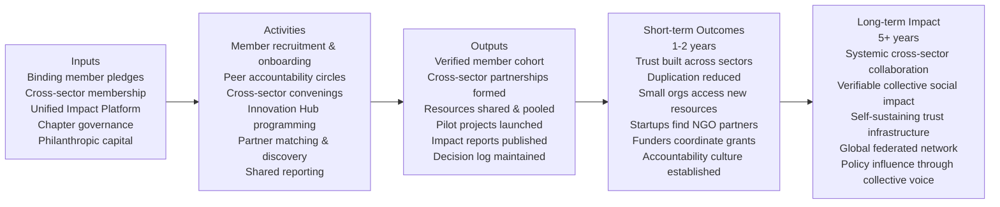

## Program Summary

Harmonia is a trust network that creates the conditions for genuine cross-sector collaboration by binding members to shared principles and pledges. The theory of change is simple: when diverse organisations commit to real accountability — not just affiliation — they collaborate more deeply, share resources more freely, and produce social impact that none could achieve alone.

## Theory of Change

> [!note] Reading this diagram
> Inputs → Activities → Outputs → Short-term Outcomes → Long-term Impact

### Pathway narrative

**Inputs** are the raw material: organisations willing to make binding commitments, a governance structure that enforces them, and a platform that makes collaboration visible and trackable.

**Activities** are what Harmonia does: recruit and onboard members with real accountability, convene them across sectors, facilitate connections and partnerships, and run programming (especially the Innovation Hub) that creates structured collaboration opportunities.

**Outputs** are what gets produced: a verified member community, documented partnerships, shared resources, and pilot projects — all with a paper trail that proves the collaboration happened.

**Short-term outcomes** are the changes in member behaviour and relationships: reduced duplication, new resource flows, cross-sector trust that didn't exist before, and smaller organisations accessing capacity they could never afford alone.

**Long-term impact** is systemic: a world where cross-sector collaboration is the default, not the exception — and where Harmonia's infrastructure makes that verifiable, not just claimed.

---

## Assumptions and Risks

| Assumption | Risk if Wrong | Mitigation |
|-----------|---------------|------------|
| Organisations will make and keep binding pledges if accountability is supportive and proportionate | Members treat pledges as performative; compliance collapses | Graduated consequences designed to be supportive first; peer circles create social accountability before formal mechanisms kick in |
| Cross-sector collaboration produces better outcomes than single-sector work | Collaboration overhead outweighs benefits for some members | Focus on thematic areas where cross-sector evidence is strongest; pilot projects generate early evidence |
| The platform enables partner discovery that wouldn't happen organically | Members don't use the platform; reverts to informal relationship-building | Keep platform UX simple; ensure it reflects real relationships, not just profiles |
| Equity between member types can be maintained at scale | Larger/wealthier members gradually dominate culture and agenda | Governance structure enforces sector balance; equity principle is constitutional (requires supermajority to change) |

---

## Data Collection Plan

- **Who collects:** Chapter Coordinators (pledge compliance, participation); Unified Impact Platform (partnerships, resource sharing); members via self-report (annual impact report)
- **How reported:** Chapter quarterly summary → Cross-Chapter Council; annual network impact report published to all members
- **Review cadence:** KPIs reviewed quarterly at Cross-Chapter Council; full impact evaluation annually; external evaluation at end of each phase (Year 1, Year 3, Year 5)

---

## Related Notes

- [[KPIs-and-Metrics]] — the specific indicators and targets
- [[Reporting-Templates]] — how members report against these outcomes
- [[Vision-and-Mission]] — the strategic goals this framework measures
- [[Accountability-Mechanisms]] — the compliance monitoring that underpins data quality
- [[Phase-1-Foundation]] — Year 1 milestones
